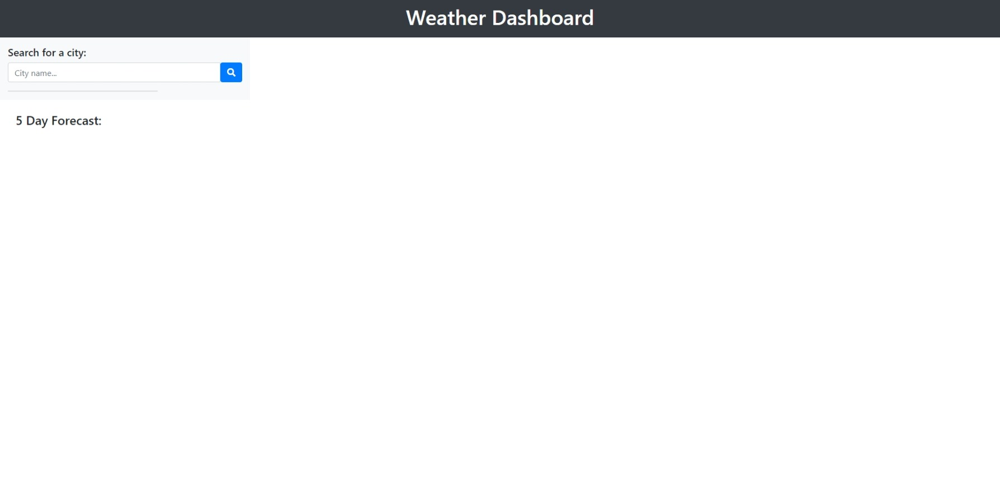
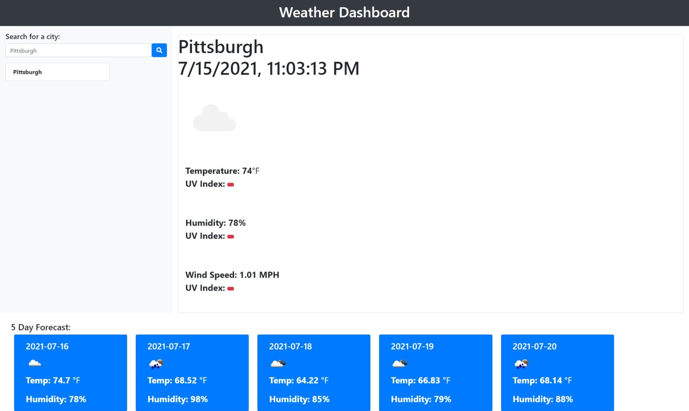

# Weather Dashboard

# Description:

Description of project: Create a Weather Dashboard that displays the current weather conditions along with the five day forecast.

## Completed Tasks

* When the user searches for a city, the user is presented with the current weather information.

* When I view current weather conditions for that city, then  I am presented with the city name, the date, an icon representation of weather conditions, the temperature, the humidity, the wind speed, and the UV index. (uv index not completed :(  )

* When I view future weather conditions for that city,
then I am presented with a 5-day forecast that displays the date, an icon representation of weather conditions, the temperature, the wind speed, and the humidity

# Screenshot

# Link to GitHub Page

[Weather Dashboard](https://matthewvandevort.github.io/Weather-Dashboard/)

# Resources Used

* [Event Listeners MDN](https://developer.mozilla.org/en-US/docs/web/api/eventlistener)

* [Bootstrap Docs](https://getbootstrap.com/docs/4.1/getting-started/introduction/)

* [jQuery Docs](https://api.jquery.com/)

* [YouTube](https://www.youtube.com/)

* [Openweather API](https://openweathermap.org/api)

# Sources

* Thanks to my Instructor Dan Gross and TA's Andrew H. and Ross K, and my tutor, Simpn Rennocks.  Also, a shout out to Cat and Jose for helping me talk through an issue.

# Unfourtunates

* I wasn't able to figure out local storage for some aweful reason and coul not get the UV Index to show up properly...Damn.